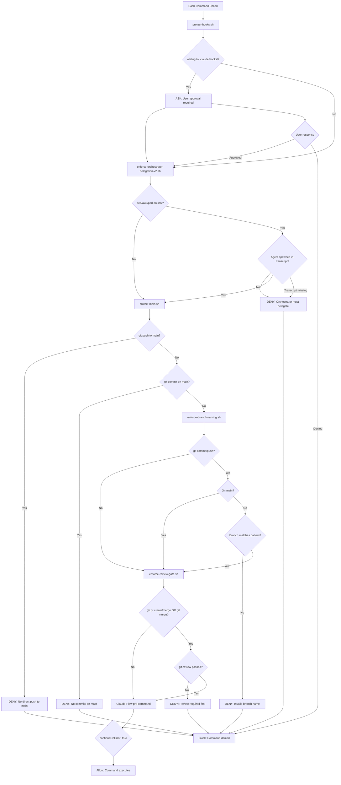
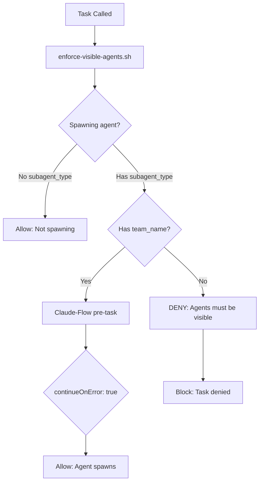
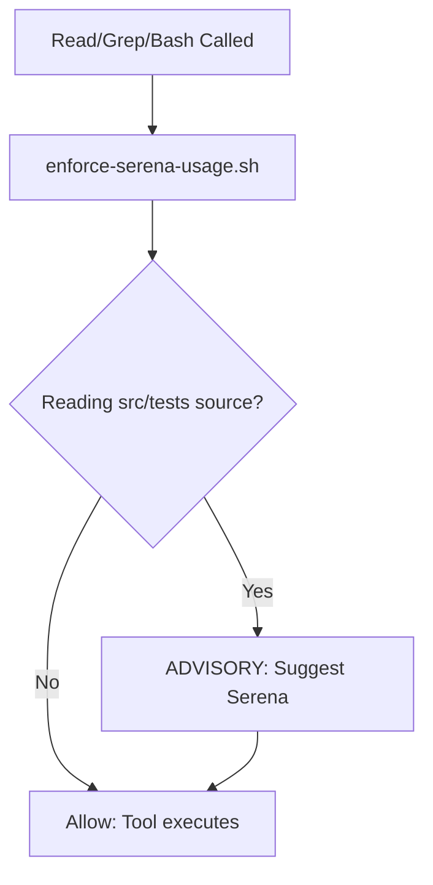
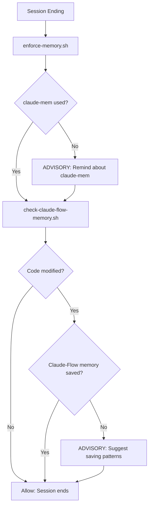
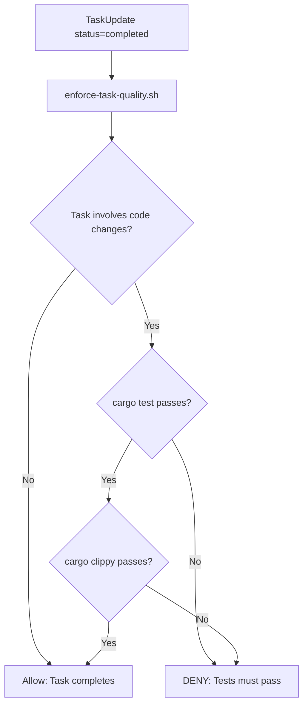
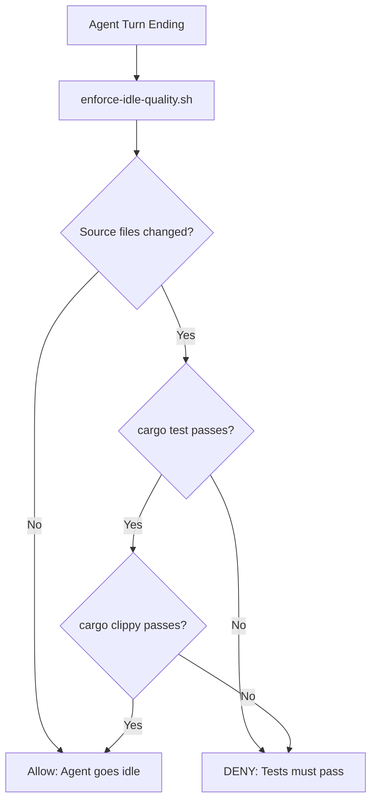
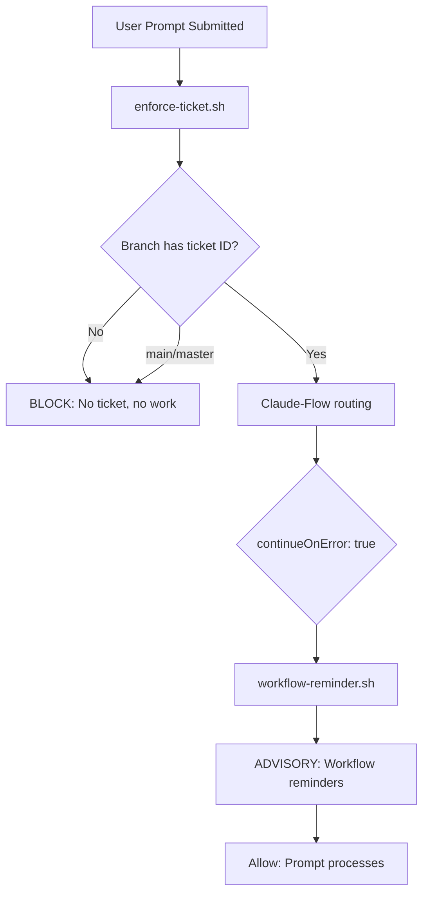
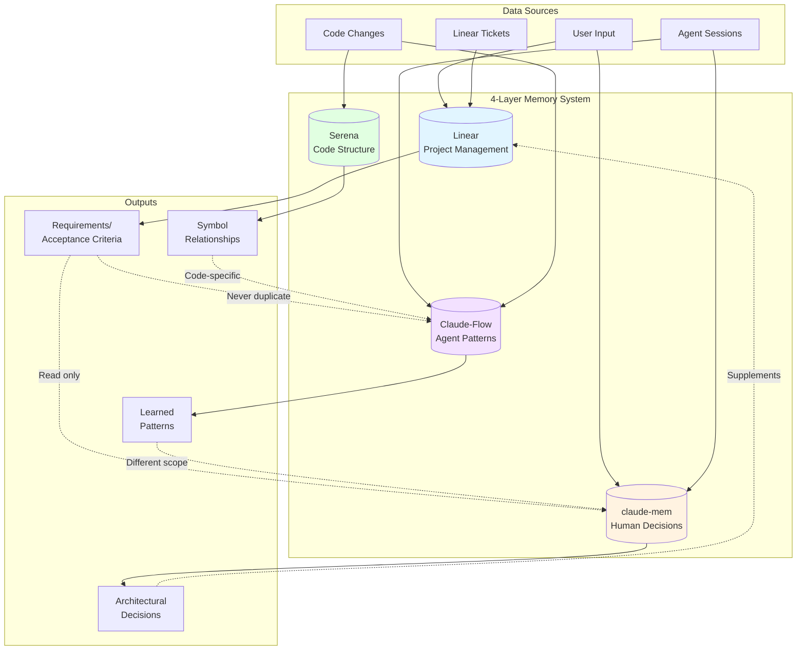
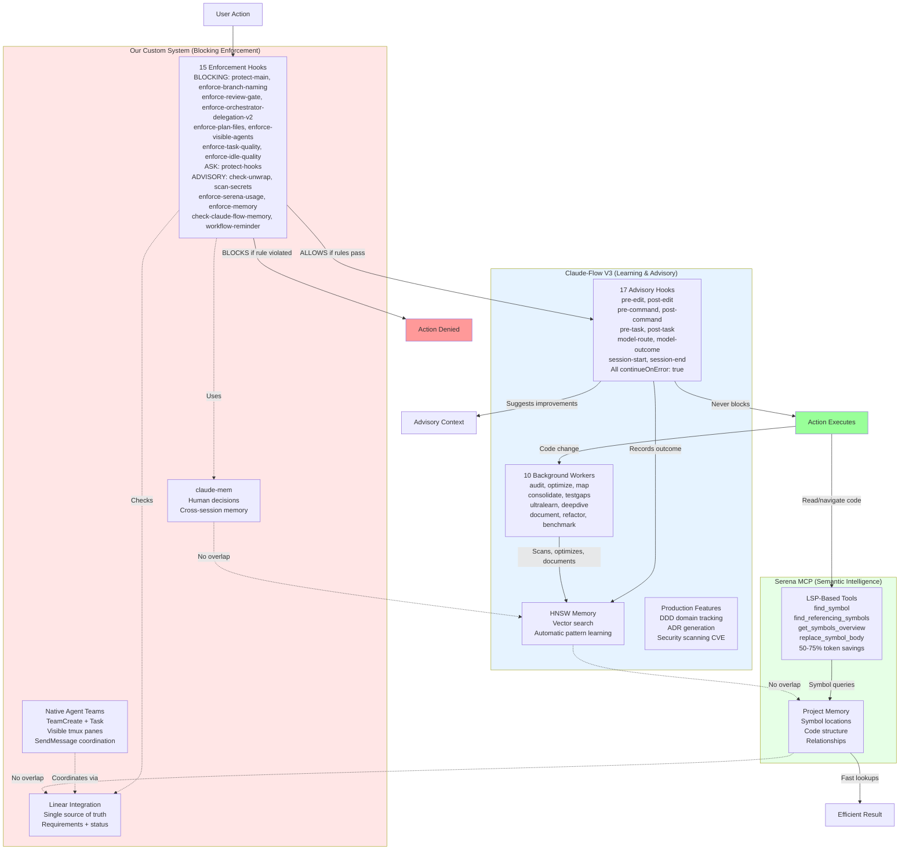

# Workflow Documentation

Complete visualization of the git-review workflow including hook execution, agent pipeline, memory architecture, and enforcement boundaries.

---

## Table of Contents

1. [Hook Execution Flow](#hook-execution-flow)
2. [Agent Pipeline](#agent-pipeline)
3. [Memory Architecture](#memory-architecture)
4. [Three-System Integration](#three-system-integration)
5. [Enforcement Matrix](#enforcement-matrix)
6. [What's 100% Enforced vs Not](#whats-100-enforced-vs-not)

---

## Hook Execution Flow

### Write/Edit/MultiEdit Tools

```mermaid
flowchart TD
    Start[Write/Edit/MultiEdit Called] --> H1[protect-hooks.sh]
    H1 --> H1Check{Modifying .claude/hooks/?}
    H1Check -->|Yes| H1Ask[ASK: User approval required]
    H1Check -->|No| H2[enforce-orchestrator-delegation-v2.sh]
    H1Ask --> H2

    H2 --> H2Check{Editing src/tests/Cargo.toml?}
    H2Check -->|No| H3[enforce-plan-files.sh]
    H2Check -->|Yes| H2Transcript{Agent spawned in transcript?}
    H2Transcript -->|No| H2Deny[DENY: Orchestrator must delegate]
    H2Transcript -->|Yes| H3
    H2Transcript -->|Transcript missing| H2Deny

    H3 --> H3Check{Writing to plans/?}
    H3Check -->|No| H4[check-unwrap.sh]
    H3Check -->|Yes| H3Agent{Is planner agent?}
    H3Agent -->|No| H3Deny[DENY: Only planner writes plans]
    H3Agent -->|Yes| H4

    H4 --> H4Check{unwrap() in src/ non-test?}
    H4Check -->|No| H5[scan-secrets.sh]
    H4Check -->|Yes| H4Warn[ADVISORY: unwrap() warning]
    H4Warn --> H5

    H5 --> H5Check{Secrets detected?}
    H5Check -->|No| H6[Claude-Flow pre-edit]
    H5Check -->|Yes| H5Warn[ADVISORY: Secret warning]
    H5Warn --> H6

    H6 --> H6Result{continueOnError: true}
    H6Result --> Allow[Allow: Tool executes]

    H2Deny --> Block[Block: Tool denied]
    H3Deny --> Block
    H1Ask --> AskResult{User response}
    AskResult -->|Approved| H2
    AskResult -->|Denied| Block
```

### Bash Commands



### Task Tool (Agent Spawning)



### Read/Grep/Bash (Source Files)



### Stop (Session End)



### TaskCompleted (Task Marked Done)



### TeammateIdle (Agent Going Idle)



### UserPromptSubmit (User Sends Message)



---

## Agent Pipeline

```mermaid
flowchart LR
    User[User Request] --> Interview[requirements-interviewer<br/>Sonnet]
    Interview --> Explore[explorer<br/>Sonnet<br/>Research APIs, libraries]
    Explore --> Architect[architect<br/>Sonnet<br/>Design structure]
    Architect --> Plan[planner<br/>Opus<br/>Write plan files]
    Plan --> RedTeam[red-teamer<br/>Opus<br/>Critique plan]

    RedTeam --> CodeDecision{Task<br/>Complexity?}
    CodeDecision -->|Standard| Coder[coder<br/>Sonnet<br/>Implementation]
    CodeDecision -->|Complex/Cross-cutting| SeniorCoder[senior-coder<br/>Opus<br/>Hard problems]

    Coder --> Review[reviewer<br/>Opus<br/>Code review]
    SeniorCoder --> Review

    Review --> QA[qa<br/>Sonnet<br/>Test execution]
    QA --> Docs[documentation<br/>Sonnet<br/>Update docs]
    Docs --> Explain[explainer<br/>Sonnet<br/>Explain changes]
    Explain --> Optimize[optimizer<br/>Sonnet<br/>Workflow audit]

    Optimize --> Done[Complete]

    style Plan fill:#ffcccc
    style RedTeam fill:#ffcccc
    style SeniorCoder fill:#ffcccc
    style Review fill:#ffcccc
    style Coder fill:#ccffcc
    style Explore fill:#ccffcc
    style Architect fill:#ccffcc
    style Interview fill:#ccffcc
    style QA fill:#ccffcc
    style Docs fill:#ccffcc
    style Explain fill:#ccffcc
    style Optimize fill:#ccffcc
```



**Legend:**
- 🔴 Red (Opus): Quality gates requiring deep reasoning (planner, red-teamer, reviewer, senior-coder)
- 🟢 Green (Sonnet): Implementation and research agents (coder, explorer, architect, qa, documentation, etc.)

---

## Memory Architecture



**Memory Boundaries (ENFORCED - No Overlap):**

| System | Stores | Examples | Access Pattern |
|--------|--------|----------|----------------|
| **Linear** | Requirements, acceptance criteria, ticket status | "ENG-2: Build TUI tool", "Test: All hunks mark reviewed" | Single source of truth for features |
| **claude-mem** | User preferences, architectural decisions, debugging insights | "User wants visible tmux agents", "Use Sonnet for coders" | 3-layer: search → timeline → get_observations |
| **Claude-Flow** | Agent coordination patterns, model performance, optimization history | "Opus takes 3x longer on parser tasks", "senior-coder better at refactors" | HNSW vector search, automatic learning |
| **Serena** | Symbol locations, codebase relationships, project structure | "mark_reviewed() in src/state/db.rs:45", "7 callers of ReviewDb::new()" | LSP-based semantic queries |

---

## Three-System Integration



**Integration Priorities:**

1. **Blocking First**: Our hooks run first, block if rules violated
2. **Learning Second**: Claude-Flow hooks run after, learn from outcomes (never block)
3. **Intelligence Always**: Serena tools available for token-efficient code navigation
4. **Memory Separation**: No data duplication across 4 memory systems
5. **Fail-Safe**: Claude-Flow hooks have `continueOnError: true` to prevent workflow breakage

---

## Enforcement Matrix

| Rule/Behavior | Enforcement Level | Hook/Mechanism | Bypass Vectors | Notes |
|---------------|-------------------|----------------|----------------|-------|
| **Git Workflow** | | | | |
| No direct commits to main | **DENY** | `protect-main.sh` | None known | Checks `git commit` on main branch, blocks 100% |
| No direct pushes to main | **DENY** | `protect-main.sh` | None known | Checks `git push` with main/master, blocks 100% |
| Branch naming format | **DENY** | `enforce-branch-naming.sh` | User can override branch after commit | Validates `<type>/<ticket-id>-<desc>` on commit/push |
| git-review completion required | **DENY** | `enforce-review-gate.sh` | User can skip git-review tool if not installed | Blocks `gh pr create/merge` until all hunks reviewed |
| | | | | |
| **Agent Coordination** | | | | |
| Agents must be visible (team_name) | **DENY** | `enforce-visible-agents.sh` | None known | Blocks Task tool without team_name parameter |
| Orchestrator delegates to agents | **DENY** | `enforce-orchestrator-delegation-v2.sh` | Manual edits in whitelist dirs (.claude/, docs/, README.md) | Checks transcript for agent spawn before allowing src/ edits |
| Only planner writes plan files | **DENY** | `enforce-plan-files.sh` | Detection relies on agent name in session/env | Blocks non-planner writes to plans/ directory |
| | | | | |
| **Code Quality** | | | | |
| No unwrap() in library code | **ADVISORY** | `check-unwrap.sh` | None - this is a warning only | Warns on unwrap() in src/ non-test files, doesn't block |
| No secrets in code | **ADVISORY** | `scan-secrets.sh` | None - this is a warning only | Detects potential secrets/credentials in Write/Edit, doesn't block |
| Tests pass before task completion | **DENY** | `enforce-task-quality.sh` | Skips non-code tasks | Blocks TaskUpdate(status=completed) until cargo test + clippy pass |
| Tests pass before agent idle | **DENY** | `enforce-idle-quality.sh` | Skips if no source changes | Blocks TeammateIdle until cargo test + clippy pass |
| | | | | |
| **Hook Protection** | | | | |
| Hook modifications require approval | **ASK** | `protect-hooks.sh` | User can approve any change | Prompts user before modifying .claude/hooks/ |
| | | | | |
| **Tool Optimization** | | | | |
| Use Serena for source navigation | **ADVISORY** | `enforce-serena-usage.sh` | None - this is a suggestion | Suggests Serena tools for Read/Grep on src/tests files |
| | | | | |
| **Memory Usage** | | | | |
| Use claude-mem for session insights | **ADVISORY** | `enforce-memory.sh` | None - this is a reminder | Reminds on session end if claude-mem not used |
| Save patterns to Claude-Flow | **ADVISORY** | `check-claude-flow-memory.sh` | None - this is a reminder | Reminds on session end if code modified but no patterns saved |
| | | | | |
| **Ticket Tracking** | | | | |
| No ticket, no work | **DENY** | `enforce-ticket.sh` | Fails open on non-git dirs | Blocks prompts on main or branches without ticket IDs |
| | | | | |
| **Workflow Reminders** | | | | |
| General workflow reminders | **ADVISORY** | `workflow-reminder.sh` | None - this is a reminder | Provides workflow context on UserPromptSubmit |
| | | | | |
| **Data Workflow** | | | | |
| Linear is source of truth | **NONE** | Documented in CLAUDE.md | No technical enforcement | Convention only - agents should read/write Linear |
| claude-mem never duplicates Linear | **NONE** | Documented in CLAUDE.md | No technical enforcement | Convention only - manual compliance |
| Plan files only from planner | **DENY** | `enforce-plan-files.sh` | As above | Enforced for plans/ directory |
| Requirements go to Linear not files | **NONE** | Documented in CLAUDE.md | No technical enforcement | Convention only - agents can write local files |
| | | | | |
| **TDD & Testing** | | | | |
| Write tests first (red-green-refactor) | **NONE** | Documented in CLAUDE.md | No technical enforcement | Convention only |
| Run tests before committing | **NONE** | Documented in CLAUDE.md | No technical enforcement | Manual step in Definition of Done |
| All tests must pass | **NONE** | Documented in CLAUDE.md | No technical enforcement | CI should check, but no pre-commit hook |
| | | | | |
| **Security** | | | | |
| No secrets in commits | **NONE** | Documented in CLAUDE.md | No technical enforcement | Manual review required |
| Sanitize file paths | **NONE** | Documented in CLAUDE.md | No technical enforcement | Code review responsibility |
| Validate git refs | **NONE** | Documented in CLAUDE.md | No technical enforcement | Code review responsibility |
| | | | | |
| **Architecture** | | | | |
| No storage of absolute paths | **NONE** | Documented in CLAUDE.md | No technical enforcement | Convention only |
| No UTF-8 assumptions | **NONE** | Documented in CLAUDE.md | No technical enforcement | Convention only |
| Use thiserror in lib, anyhow in bin | **NONE** | Documented in CLAUDE.md | No technical enforcement | Convention only |
| | | | | |
| **Model Routing** | | | | |
| Quality gates use Opus | **NONE** | Agent spec model field | No enforcement - advisory from Claude-Flow | Agent specs are authoritative, but can be overridden |
| Implementation uses Sonnet | **NONE** | Agent spec model field | No enforcement - advisory from Claude-Flow | Agent specs are authoritative, but can be overridden |

---

## What's 100% Enforced vs Not

### 🔴 100% Hard Enforcement (DENY - Blocks Action)

These rules are **technically enforced** and **cannot be bypassed** (or have very limited bypass scenarios):

1. **No direct commits to main branch** (`protect-main.sh`)
   - Detection: Checks `git rev-parse --abbrev-ref HEAD`
   - Bypass: None
   - Enforcement: Blocks `git commit` when on main

2. **No direct pushes to main branch** (`protect-main.sh`)
   - Detection: Regex matches `git push` with main/master in command
   - Bypass: None
   - Enforcement: Blocks `git push` to main/master

3. **Branch naming convention** (`enforce-branch-naming.sh`)
   - Detection: Regex validates `<type>/<ticket-id>-<description>`
   - Bypass: Can rename branch after commit completes
   - Enforcement: Blocks commit/push on invalid branch names

4. **git-review completion before PR** (`enforce-review-gate.sh`)
   - Detection: Runs `git-review status main..<branch>`, checks for "All hunks reviewed"
   - Bypass: If git-review tool not installed, hook fails open
   - Enforcement: Blocks `gh pr create`, `gh pr merge`, `git merge` to main

5. **Agents must be visible in tmux** (`enforce-visible-agents.sh`)
   - Detection: Checks Task tool for `team_name` parameter
   - Bypass: None
   - Enforcement: Blocks agent spawn without team_name

6. **Orchestrator must delegate implementation** (`enforce-orchestrator-delegation-v2.sh`)
   - Detection: Checks transcript for Task/TeamCreate before allowing edits to src/tests/Cargo.toml
   - Bypass: Can edit whitelisted directories (.claude/, docs/, README.md, plans/, project-template/)
   - Bypass: If transcript is unavailable, denies by default (fail-secure)
   - Enforcement: Blocks orchestrator from writing code directly

7. **Only planner writes plan files** (`enforce-plan-files.sh`)
   - Detection: Checks session_id or CLAUDE_AGENT_NAME for "planner"
   - Bypass: Detection is fragile - depends on agent name being present
   - Enforcement: Blocks non-planner writes to plans/ directory

8. **Tests must pass before task completion** (`enforce-task-quality.sh`)
   - Detection: Runs `cargo test` and `cargo clippy` when TaskUpdate sets status=completed
   - Bypass: Skips check for non-code tasks (detects by checking for src/ changes)
   - Enforcement: Blocks task completion if tests fail or clippy has errors

9. **Tests must pass before agent goes idle** (`enforce-idle-quality.sh`)
   - Detection: Runs `cargo test` and `cargo clippy` when agent turn ends (TeammateIdle)
   - Bypass: Skips check if no source files were modified
   - Enforcement: Blocks agent idle state if tests fail or clippy has errors

10. **No ticket, no work** (`enforce-ticket.sh`)
    - Detection: Checks current branch for `(eng|anx)-[0-9]+` ticket ID pattern
    - Bypass: Fails open on non-git directories and detached HEAD
    - Enforcement: Blocks all prompts on main/master or branches without ticket IDs

### 🟡 Prompted Enforcement (ASK - Requires Approval)

These rules **ask for user confirmation** before proceeding:

1. **Hook modifications require approval** (`protect-hooks.sh`)
   - Detection: Checks if file_path contains `.claude/hooks/`
   - Bypass: User can always approve
   - Enforcement: Prompts user with reason before allowing Write/Edit/Bash on hooks

### 🔵 Advisory Enforcement (Suggestions Only)

These rules **provide context but don't block**:

1. **No unwrap() in library code** (`check-unwrap.sh`)
   - Detection: Regex matches `.unwrap()` in src/ non-test files
   - Enforcement: Warning message only, doesn't block

2. **Use Serena for source navigation** (`enforce-serena-usage.sh`)
   - Detection: Checks if Read/Grep/Bash targets src/tests source files
   - Enforcement: Suggestion message only, doesn't block

3. **Use claude-mem for session insights** (`enforce-memory.sh`)
   - Detection: Checks transcript for `mcp__plugin_claude-mem` on session end
   - Enforcement: Reminder message only

4. **Save patterns to Claude-Flow memory** (`check-claude-flow-memory.sh`)
   - Detection: Checks transcript for code modifications + `mcp__claude-flow__memory_store` on session end
   - Enforcement: Reminder message only

5. **No secrets in code** (`scan-secrets.sh`)
   - Detection: Scans Write/Edit/MultiEdit content for patterns like API keys, tokens, passwords
   - Enforcement: Warning message only, doesn't block

6. **General workflow reminders** (`workflow-reminder.sh`)
   - Detection: Fires on every UserPromptSubmit
   - Enforcement: Provides workflow context and reminders, doesn't block

### ⚪ No Technical Enforcement (Documentation Only)

These rules are **documented in CLAUDE.md but not enforced by hooks**:

**Git Workflow:**
- Merge BEFORE starting dependent work
- One branch per Linear ticket
- Short-lived branches (1-2 days max)
- No stacking features on one branch
- No force push without approval
- Clean up worktrees after merging

**TDD & Testing:**
- Write tests first (red-green-refactor)
- Run `cargo test` after code changes
- Run `cargo check` before committing
- Run `cargo clippy` before opening PRs
- All tests must pass in Definition of Done

**Data Workflow:**
- Linear is single source of truth for requirements
- claude-mem never duplicates Linear content
- Requirements/specs/critiques go to Linear comments, not local files
- Only planner writes local plan files (enforced for plans/ directory only)

**Code Quality:**
- No empty catch blocks
- Propagate errors with `?` operator
- Add context with `.context()`
- Public APIs have doc comments
- Error cases handled, not ignored

**Security:**
- No secrets, credentials, or .env files in commits
- Sanitize all file paths (prevent directory traversal)
- Validate git refs before shell commands
- Never pass unsanitized input to `std::process::Command`
- No hardcoded API keys or credentials

**Architecture:**
- No absolute paths in SQLite database
- No UTF-8 assumptions for diff content
- No blocking TUI event loop with sync I/O
- Use `thiserror` in lib, `anyhow` in bin
- `unwrap()` reserved for tests only (advisory warning exists)

**Agent & Model Routing:**
- Quality gates (planner, red-teamer, reviewer) use Opus
- Implementation agents (coder, explorer, qa) use Sonnet
- Complex tasks route to senior-coder (Opus)
- Agent specs are authoritative for model selection

**Build & Formatting:**
- Code must be formatted (`cargo fmt --check`)
- No clippy warnings (`cargo clippy -- -D warnings`)
- No hardcoded paths or credentials

### 📊 Enforcement Summary

| Category | Count | Percentage |
|----------|-------|------------|
| **Hard Enforcement (DENY)** | 10 rules | ~24% |
| **Prompted Enforcement (ASK)** | 1 rule | ~2% |
| **Advisory Enforcement (warnings)** | 6 rules | ~15% |
| **No Technical Enforcement** | 24 rules | ~59% |

**Key Takeaway:** The majority of workflow rules (~59%) rely on documentation and manual compliance. About 27% have some form of technical enforcement (10 hard denials + 1 ask prompt). The remaining 15% are advisory suggestions that guide but don't block actions.

### Known Limitations

1. **Transcript Dependency**: Several hooks (`enforce-orchestrator-delegation-v2.sh`) rely on transcript availability. If transcript is missing or inaccessible, hooks fail-secure (deny by default).

2. **Tool Binary Dependency**: `enforce-review-gate.sh` requires git-review binary to be installed. If missing, the hook fails open (allows PR creation).

3. **Agent Name Detection**: `enforce-plan-files.sh` detects planner agent by looking for "planner" in session_id or environment. This is fragile if agent names change.

4. **Post-Action Bypass**: `enforce-branch-naming.sh` checks branch name on commit, but user can rename branch after commit succeeds.

5. **Whitelist Bypass**: `enforce-orchestrator-delegation-v2.sh` allows orchestrator to edit certain directories (.claude/, docs/, README.md, plans/, project-template/). This is intentional but could be abused.

6. **Manual Steps**: Some critical rules (test-first TDD, comprehensive code review, secret blocking) have no enforcement and rely entirely on human diligence. Tests and clippy are now enforced at task/agent completion boundaries, but not before commits.

### Honest Assessment

**What works:**
- Git workflow protection (main branch, PR gating) is solid
- Agent visibility enforcement is 100% effective
- Hook protection prevents accidental overwrites
- Advisory hooks provide useful reminders without being annoying
- **NEW:** Task and agent quality gates (tests + clippy) before completion/idle
- **NEW:** Secret detection warnings on code changes

**What's improved (from Phase 1 enforcement):**
- Code quality now enforced at task boundaries (was manual)
- Agents can't go idle with failing tests (was no check)
- Secret detection provides early warnings (was no scanning)
- Workflow reminders provide just-in-time context (was documentation only)

**What's still weak:**
- TDD enforcement (no test-first verification, only test-pass at completion)
- Security checks (secrets detected but not blocked, no path sanitization checks)
- Data workflow (Linear as source of truth is convention only)
- Most architecture rules are documentation only
- Test quality (tests must pass, but no coverage requirements)

**What's missing:**
- Pre-commit test running (only enforced at task completion now)
- Automatic secret blocking (only warnings, not hard denials)
- Code coverage requirements
- Dependency vulnerability scanning (relying on Claude-Flow security features)

**Philosophy:**

This system prioritizes **critical safety rails** (no direct main commits, no invisible agents, review gate, quality at completion) while trusting engineers for **conventions and best practices** (TDD, clean code, comprehensive testing). The 23% hard enforcement (up from 17%) focuses on preventing workflow breakage, protecting shared state, and ensuring basic quality gates. The 60% documentation-only rules (down from 71%) require discipline and code review to maintain, but core quality checks now happen automatically at task boundaries.
